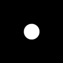
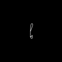
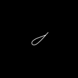
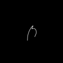
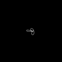
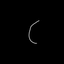
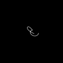

# csb-dataset-generator

Implementation of some blurring algorithms, and a esay way to integrate them in PyTorch neural network training. The types of blur considered are:

* out-of-focus blur, implemented by convolution with a disk-shaped kernel
* camera shake blur, implemented by adapting the algorithms presented in [[1]](#1)

All the functions used to generate kernels are in [psf_generation](psf_generation). Those functions are used by the classes in [random_degradation](random_degradation). Those classes are initialized with the degradation parameters, and allow the generation of images with a random degradation each time, within the parameters set during the initialization. The degradation implemented are:

* random out of focus blur, by picking a range of radiuses for the disk kernel;
* random camera shake blur, by generating a new camera shake kernel for each image;
* random noisy camera shake blur, same as the previous but including the application of noise as in [[1]](#1);
* constant trajectory degradation, same as the previous but the trajectory is kept the same, to better show the tradeoff between noise and blur.

The random degradation classes can be integrated in the training of PyTorch neural networks as shown in [notebooks](notebooks)

## Blur formulation

We denote the blurring degradation process as a function of the sharp image $\mathbf{x}$

$
    \mathbf{y} = \Phi (\mathbf{x}) ,
$

where $\mathbf{y}$ is the blurred image, and $\Phi$ is the blurring process. Under the assumption of spatially invariant blur, the degradation can be represented as a convolution with a Point Spread Function (PSF) kernel $\mathbf{k}$

$
    \mathbf{y} = \mathbf{k} \ast \mathbf{x} .
$

Multiple types of blur exist. 

### Out-of-focus blur
Out-of-focus blur happens when the camera fails to focus the scene onto the sensor. It can be mimicked using a disk-shaped kernel, which represents how light from a point source spreads through an optical system.

Here are some examples of disk kernels, generated this package:

 &nbsp;  &nbsp; 

### Camera shake blur
Camera shake blur happens when the camera moves while acquiring an image. Under some assumptions, this can be modeled with a kernel that represents the trajectory of the camera movement during the exposure. This kernel is not as trivial to synthesize as a disk kernel, as it can take into account complex motion patterns, depending on the desired realism of the blur. 

Here are some examples of disk kernels, generated this package:

 &nbsp;  &nbsp; 

 &nbsp;  &nbsp; 

In this formulation, additionally to the camera shake blur degradation, we include a noise component, as proposed in  [[1]](#1). To the blurred image is applied Poisson noise, caused by the statistical nature of photon detection, and Gaussian noise, caused by the amplification of the electrical signal:

$
    \mathbf{y} = (\mathbf{u} + \mathbf{n})/T ,
$

$
    \mathbf{u} \sim \mathcal{P}(\lambda(\mathbf{\mathbf{k} \ast \mathbf{x}})) ,
$    

$
    \mathbf{n} \sim \mathcal{N}(0, \sigma^2) , 
$

where $\sigma$ quantifies the thermal and electrical noise of the system, and $\lambda$ the quantum efficiency of the sensor. The parameter $T$ represents the exposure time, and controls the length of the trajectory of the blurring kernel. It is the same value as the sum of the kernel pixels. The authors use this value to simulate the tradeoff between blur and noise present in cameras: when $T$ is small, the signal range is shrunk, increasing the noise effect, and reducing the blur magnitude. The multiplication by $1/T$ is an amplification factor that serves to restore the full dynamic range of the image. This is the same tradeoff between blur and noise that we can find in cameras.

### Object motion blur
Object motion blur happens when an object moves during the exposure process. This is the most complex type of blur, as it is a spatially variant, and cannot be modeled as a convolution. We don't address it here, as other datasets like the GoPro dataset already exist.

Real-life blurred pictures can have multiple types of blur mixed together. Depending on the blurring effects taken into account, the deblurring methods can vary.

## References
<a id="1">[1]</a> 
Boracchi, Giacomo, and Alessandro Foi. "Modeling the performance of image restoration from motion blur." IEEE Transactions on Image Processing 21.8 (2012): 3502-3517.